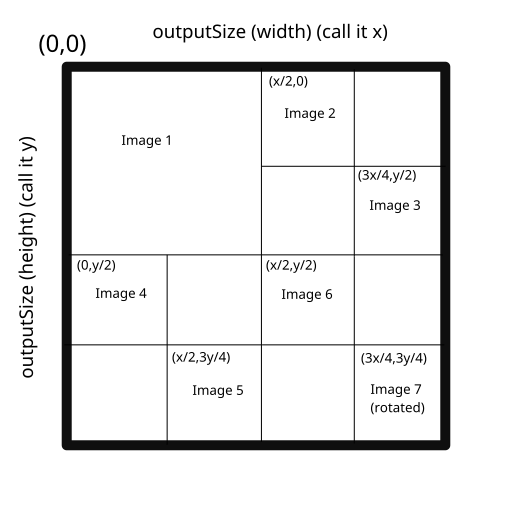

# Lossify
LOSS ISN'T DEAD

## Love Loss meme?
Then this script is for you. Use this script to convert any 7 images into loss.

### Prerequistics
* Python 3
* [Pillow module](https://pillow.readthedocs.io/en/4.3.x/)

### Usage

```
python lossify.py path_to_config_file
```
The config file is a json file which holds the options you want to pass

### Config file

The config file supports these options - 

#### "ouputName" (string) (optional)
The name of the output file. Defaults to "loss.png"

#### "outputSize" (string) (optional)
Comma seperated string of size (width, height) of the output. Defaults to 512,512.

#### "background" (string) (optional)
Background color of the output (r,g,b). Defaults to white(255,255,255).

#### "images" (list) (required)

This option must be an array of length 7. Each entry in this array corresponds to one image. Each image supports these options:
  ##### "name" (string) (required)
  This option is path to the image file
  ##### "size" (string) (optional)
  This specifies the size to which the image will be resized and pasted in the ouput. Defaults to outputSize/2,outputSize/2 for the first one and outputSize/4,outputSize/4 for others.
  ##### "position" (string) (optional)
  This specifies the position at which this image will be pasted. For defaults see below
  ##### "rotateAngle" (integer) (optional)
  This specifies through which angle the image will be rotated. Defaults to 90 degree clockwise for the last one and 0 for others

## Layout and sizing

This is the default layout of output image


